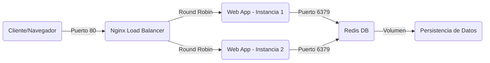

# Documentación Técnica - Obligatorio Sistemas Operativos 2025

## Índice

1. [Ejercicio 1 - Bash: Sistema de Inventario Citadel](#ejercicio-1)
2. [Ejercicio 2 - POSIX: Panel de Aeropuerto](#ejercicio-2)
3. [Ejercicio 3 - ADA: Sistema de Tambo](#ejercicio-3)
4. [Ejercicio 4 - DOCKER: SISTEMA DE GESTIÓN DE TAREAS](#ejercicio-4)

---

<a name="ejercicio-1"></a>

## EJERCICIO 1 - BASH: SISTEMA DE INVENTARIO CITADEL

### 1. Introducción

Este documento detalla la implementación de un sistema de inventario para la empresa Citadel, desarrollado completamente en Bash scripting. El sistema permite gestionar productos de pintura para miniaturas, con funcionalidades de autenticación de usuarios, control de stock y generación de reportes.

### 2. Arquitectura del Sistema

#### 2.1 Estructura de Archivos

El sistema utiliza una arquitectura basada en archivos planos organizados en el directorio `data/`:

```
ejercicio1.sh (script principal)
├── data/
│   ├── usuarios.db      # Base de datos de usuarios (formato: usuario:contraseña)
│   ├── sesion.db        # Usuario actualmente logueado
│   └── productos.db     # Inventario de productos (formato delimitado por |)
└── Datos/
    └── datos.CSV        # Reporte generado
```

#### 2.2 Formato de Datos

**usuarios.db:**

```
usuario:contraseña
admin:admin
```

**sesion.db:**

```
usuario_actual
```

**productos.db:**

```
CODIGO|TIPO|MODELO|DESCRIPCION|CANTIDAD|PRECIO
CON|Contrast|Blood Angels Red|Pintura contrast roja|50|400
```

### 3. Implementación Detallada

#### 3.1 Inicialización del Sistema

```bash
DIR_BASE="$(cd "$(dirname "${BASH_SOURCE[0]}")" && pwd)"
DIR_DATOS="$DIR_BASE/data"
```

**Explicación:**

- `${BASH_SOURCE[0]}`: Variable que contiene la ruta del script actual
- `dirname`: Extrae el directorio del path completo
- `cd` + `pwd`: Navegamos al directorio y obtenemos la ruta absoluta
- Esto garantiza que el script funcione independientemente desde dónde se ejecute

#### 3.2 Tipos de Pintura

```bash
TIPOS=("Base" "Layer" "Shade" "Dry" "Contrast" "Technical" "Texture" "Mediums")
```

**Explicación:**

- Array de Bash que contiene todos los tipos válidos de pintura
- Se utiliza para validación de entrada y filtrado

#### 3.3 Función: crear_archivos()

```bash
crear_archivos() {
    mkdir -p "$DIR_DATOS"
    touch "$ARCHIVO_USUARIOS" "$ARCHIVO_SESION" "$ARCHIVO_PRODUCTOS"
    if ! grep -q "^admin:" "$ARCHIVO_USUARIOS" 2>/dev/null; then
        echo "admin:admin" >> "$ARCHIVO_USUARIOS"
    fi
}
```

**Comandos utilizados:**

- `mkdir -p`: Crea directorios, incluyendo padres si no existen. `-p` evita errores si ya existe
- `touch`: Crea archivos vacíos si no existen
- `grep -q`: Búsqueda silenciosa (quiet), retorna código de salida sin imprimir
- `^admin:`: Expresión regular que busca líneas que comienzan con "admin:"
- `2>/dev/null`: Redirige errores estándar a /dev/null (descarta mensajes de error)
- `>>`: Redirección que añade contenido al final del archivo

**Lógica:**

1. Crea la estructura de directorios necesaria
2. Crea los archivos de base de datos si no existen
3. Verifica si existe el usuario admin, si no lo crea

#### 3.4 Función: tipo_valido()

```bash
tipo_valido() {
    local t="$1"
    for x in "${TIPOS[@]}"; do
        if [ "$x" = "$t" ]; then
            return 0
        fi
    done
    return 1
}
```

**Comandos utilizados:**

- `local`: Declara variable con scope local a la función
- `"${TIPOS[@]}"`: Expande todos los elementos del array
- `return 0`: Retorna código de éxito (true en Bash)
- `return 1`: Retorna código de error (false en Bash)

**Lógica:**
Recorre el array de tipos válidos y compara con el tipo proporcionado. Retorna 0 si es válido, 1 si no lo es.

#### 3.5 Función: usuario_actual()

```bash
usuario_actual() {
    if [ -s "$ARCHIVO_SESION" ]; then
        cat "$ARCHIVO_SESION"
    else
        echo ""
    fi
}
```

**Comandos utilizados:**

- `[ -s archivo ]`: Test que verifica si el archivo existe y tiene tamaño mayor a 0
- `cat`: Concatena e imprime contenido de archivo
- `echo ""`: Imprime cadena vacía

**Lógica:**
Retorna el nombre del usuario logueado si existe sesión activa, caso contrario retorna cadena vacía.

#### 3.6 Función: crear_usuario()

```bash
crear_usuario() {
    while true; do
        read -p "Nombre de usuario: " nombre_usuario
        if grep -q "^$nombre_usuario:" "$ARCHIVO_USUARIOS"; then
            echo "Error: el usuario '$nombre_usuario' ya existe. Intente con otro por favor."
        else
            echo
            read -s -p "Contrasena: " contrasena
            echo
            read -s -p "Confirmar contrasena: " contrasena2
            echo
            if [ -z "$contrasena" ]; then
                echo "La contrasena no puede ser vacía."
            elif [ "$contrasena" != "$contrasena2" ]; then
                echo "Las contrasenas no coinciden. Intente de nuevo."
            else
                break
            fi
        fi
    done
    echo "$nombre_usuario:$contrasena" >> "$ARCHIVO_USUARIOS"
    echo "Usuario '$nombre_usuario' creado con éxito."
}
```

**Comandos utilizados:**

- `read -p "prompt"`: Lee entrada del usuario mostrando un prompt
- `read -s`: Lee entrada en modo silencioso (no muestra caracteres, ideal para contraseñas)
- `[ -z "$var" ]`: Test que verifica si la variable está vacía
- `grep -q "^$nombre_usuario:"`: Busca líneas que comiencen con el nombre de usuario seguido de ":"

**Lógica del bucle:**

1. Solicita nombre de usuario
2. Verifica que no exista en la base de datos
3. Solicita contraseña dos veces
4. Valida que no esté vacía y que coincidan
5. Sale del bucle con `break` cuando todas las validaciones son exitosas
6. Añade el nuevo usuario al archivo

#### 3.7 Función: cambiar_contrasena()

```bash
cambiar_contrasena() {
    usuario_act="$(usuario_actual)"
    if [ -z "$usuario_act" ]; then
        echo "Necesitas logearte para cambiar la contrasena."
        return
    fi

    while true; do
        echo "Cambiando la contrasena de '$usuario_act'"
        read -s -p "Contrasena actual: " contrasena_actual
        echo

        contrasena_guardada="$(grep "^$usuario_act:" "$ARCHIVO_USUARIOS" | cut -d: -f2-)"

        if [ "$contrasena_actual" != "$contrasena_guardada" ]; then
            echo "Contrasena actual incorrecta."
            return
        fi

        read -s -p "Nueva contrasena: " nueva_contrasena
        echo
        read -s -p "Confirmar nueva contrasena: " nueva_contrasena2
        echo

        if [ -z "$nueva_contrasena" ]; then
            echo "La nueva contrasena no puede ser vacía."
        elif [ "$nueva_contrasena" != "$nueva_contrasena2" ]; then
            echo "Las contrasenas no coinciden. Intente otra vez."
        else
            sed -i "s/^$usuario_act:.*/$usuario_act:$nueva_contrasena/" "$ARCHIVO_USUARIOS"
            echo "Contrasena actualizada con éxito."
            break
        fi
    done
}
```

**Comandos utilizados:**

- `cut -d: -f2-`: Corta la línea usando `:` como delimitador, extrae desde el campo 2 en adelante
- `sed -i`: Edita archivo in-place (modifica el archivo directamente)
- `s/patrón/reemplazo/`: Comando de sustitución de sed
- `^$usuario_act:.*`: Expresión regular que busca línea que comienza con usuario seguido de `:` y cualquier cosa después

**Lógica:**

1. Verifica que haya usuario logueado
2. Solicita contraseña actual y la valida contra la almacenada
3. Solicita nueva contraseña dos veces
4. Valida que no esté vacía y que coincidan
5. Usa `sed` para reemplazar la línea completa del usuario con la nueva contraseña

#### 3.8 Función: login_usuario()

```bash
login_usuario() {
    if [ -n "$(usuario_actual)" ]; then
        echo "Ya hay un usuario logueado: $(usuario_actual). Haga logout antes."
        return
    fi

    while true; do
        read -p "Usuario: " usuario_int
        read -s -p "Contrasena: " contrasena_int
        echo

        contrasena_guardada="$(grep "^$usuario_int:" "$ARCHIVO_USUARIOS" | cut -d: -f2-)"

        if [ -z "$contrasena_guardada" ]; then
            echo "Usuario no encontrado."
            return
        fi

        if [ "$contrasena_int" = "$contrasena_guardada" ]; then
            echo "$usuario_int" > "$ARCHIVO_SESION"
            echo "BIENVENIDO: $usuario_int"
            return
        else
            echo "Contrasena incorrecta."
        fi
    done
}
```

**Comandos utilizados:**

- `[ -n "$var" ]`: Test que verifica si la variable NO está vacía
- `>`: Redirección que sobrescribe el archivo

**Lógica:**

1. Verifica que no haya sesión activa
2. Solicita credenciales
3. Busca el usuario en la base de datos
4. Valida la contraseña
5. Guarda el usuario en el archivo de sesión
6. Muestra mensaje de bienvenida

#### 3.9 Función: logout_usuario()

```bash
logout_usuario() {
    if [ ! -n "$(usuario_actual)" ]; then
        echo "No hay ningún usuario logeado."
        return
    fi
    echo "" > "$ARCHIVO_SESION"
    echo "Logout exitoso."
}
```

**Lógica:**
Verifica que haya sesión activa y limpia el archivo de sesión.

#### 3.10 Función: ingresar_producto()

```bash
ingresar_producto() {
    usuario_act="$(usuario_actual)"
    if [ -z "$usuario_act" ]; then
        echo "Necesitas logearte para ingresar un producto."
        return
    fi

    echo "Ingreso de nuevo producto"
    echo "Tipos válidos: ${TIPOS[*]}"

    read -p "Tipo: " tipo
    if ! tipo_valido "$tipo"; then
        echo "Tipo inválido. Operación cancelada."
        return
    fi

    read -p "Modelo (nombre): " modelo
    if [ -z "$modelo" ]; then
        echo "El modelo no puede estar vacío."
        return
    fi

    read -p "Descripción breve: " descripcion

    while true; do
        read -p "Cantidad (entero >=0): " cantidad
        if [[ "$cantidad" =~ ^[0-9]+$ ]]; then break
        else echo "Cantidad inválida."; fi
    done

    while true; do
        read -p "Precio unitario (entero): " precio
        if [[ "$precio" =~ ^[0-9]+$ ]]; then break
        else echo "Precio inválido."; fi
    done

    codigo_tipo="$(echo "$tipo" | cut -c1-3 | tr '[:lower:]' '[:upper:]')"

    archivo_tmp="$(mktemp)"
    encontrado=0

    while IFS='|' read -r cod t m d old_cant old_precio; do
        if [ "$t" = "$tipo" ] && [ "$m" = "$modelo" ]; then
            nuevo_cant=$((old_cant + cantidad))
            echo "$cod|$t|$m|$descripcion|$nuevo_cant|$precio" >> "$archivo_tmp"
            encontrado=1
        else
            echo "$cod|$t|$m|$d|$old_cant|$old_precio" >> "$archivo_tmp"
        fi
    done < "$ARCHIVO_PRODUCTOS"

    if [ "$encontrado" -eq 0 ]; then
        printf "%s|%s|%s|%s|%s|%s\n" "$codigo_tipo" "$tipo" "$modelo" "$descripcion" "$cantidad" "$precio" >> "$archivo_tmp"
        echo "Producto nuevo registrado."
    else
        echo "Producto existente actualizado."
    fi

    mv "$archivo_tmp" "$ARCHIVO_PRODUCTOS"

    echo "✅ Estado actual del producto:"
    grep "|$tipo|$modelo|" "$ARCHIVO_PRODUCTOS" || true
}
```

**Comandos utilizados:**

- `${TIPOS[*]}`: Expande todos los elementos del array separados por espacio
- `[[ "$var" =~ ^[0-9]+$ ]]`: Test de expresión regular, valida que sea número entero positivo
- `cut -c1-3`: Corta caracteres desde posición 1 hasta 3
- `tr '[:lower:]' '[:upper:]'`: Transforma caracteres de minúscula a mayúscula
- `mktemp`: Crea archivo temporal con nombre único
- `IFS='|'`: Internal Field Separator, define el delimitador para lectura
- `read -r`: Lee línea sin interpretar backslashes
- `$((expresión))`: Aritmética de Bash
- `printf`: Imprime con formato específico
- `|| true`: Operador OR lógico que asegura que el comando retorne éxito

**Lógica:**

1. Verifica autenticación
2. Valida y solicita datos del producto
3. Genera código de 3 letras del tipo en mayúsculas
4. Crea archivo temporal
5. Lee todos los productos existentes
6. Si encuentra coincidencia de tipo+modelo, suma cantidades
7. Si no existe, lo añade como nuevo producto
8. Reemplaza archivo original con el temporal
9. Muestra el estado final del producto

#### 3.11 Función: vender_producto()

```bash
vender_producto() {
    usuario_act="$(usuario_actual)"
    if [ -z "$usuario_act" ]; then
        echo "Debes estar logeado para vender productos."
        return
    fi

    if [ ! -s "$ARCHIVO_PRODUCTOS" ]; then
        echo "No hay productos cargados."
        return
    fi

    echo "Productos disponibles:"
    mapfile -t lista_productos < "$ARCHIVO_PRODUCTOS"

    for i in "${!lista_productos[@]}"; do
        IFS='|' read -r cod tipo mod desc cant precio <<< "${lista_productos[$i]}"
        echo "$((i+1))) $tipo - $mod - \$ $precio (Stock: $cant)"
    done

    resumen_tipos=()
    resumen_modelos=()
    resumen_cantidades=()
    resumen_totales=()

    while true; do
        read -p "Ingrese número de producto a comprar (0 para finalizar): " num
        if [ "$num" = "0" ]; then
            break
        fi

        if ! [[ "$num" =~ ^[0-9]+$ ]] || (( num < 1 || num > ${#lista_productos[@]} )); then
            echo "Número inválido."
            continue
        fi

        index=$((num-1))
        IFS='|' read -r cod tipo mod desc cant precio <<< "${lista_productos[$index]}"

        if [ "$cant" -eq 0 ]; then
            echo "No hay stock disponible para este producto."
            continue
        fi

        read -p "Cantidad a comprar: " compra
        if ! [[ "$compra" =~ ^[0-9]+$ ]] || (( compra < 1 || compra > cant )); then
            echo "Cantidad inválida o insuficiente stock."
            continue
        fi

        nuevoCant=$((cant - compra))
        lista_productos[$index]="$cod|$tipo|$mod|$desc|$nuevoCant|$precio"

        total=$((precio * compra))
        resumen_tipos+=("$tipo")
        resumen_modelos+=("$mod")
        resumen_cantidades+=("$compra")
        resumen_totales+=("$total")

        echo "Producto agregado a la compra."
    done

    if [ ${#resumen_tipos[@]} -eq 0 ]; then
        echo "No se realizó ninguna compra."
        return
    fi

    printf "%s\n" "${lista_productos[@]}" > "$ARCHIVO_PRODUCTOS"

    echo
    echo "====== RESUMEN DE COMPRA ======"
    total_final=0
    for i in "${!resumen_tipos[@]}"; do
        echo "- ${resumen_tipos[$i]} | ${resumen_modelos[$i]} | Cantidad: ${resumen_cantidades[$i]} | Total: \$ ${resumen_totales[$i]}"
        total_final=$((total_final + resumen_totales[$i]))
    done
    echo "TOTAL A PAGAR: \$ $total_final"
    echo "=============================="
}
```

**Comandos utilizados:**

- `mapfile -t array < archivo`: Lee archivo línea por línea en un array (flag -t elimina newlines)
- `"${!array[@]}"`: Expande los índices del array
- `<<<`: Here-string, pasa string como entrada estándar
- `${#array[@]}`: Retorna el tamaño del array
- `(( expresión ))`: Evaluación aritmética, retorna true/false
- `array+=("elemento")`: Añade elemento al final del array

**Lógica:**

1. Carga todos los productos en memoria usando un array
2. Muestra lista numerada de productos
3. Inicia arrays vacíos para el resumen de compra
4. Loop de compra:
   - Solicita número de producto
   - Valida que esté en rango
   - Solicita cantidad
   - Valida stock disponible
   - Actualiza stock en el array en memoria
   - Guarda detalles en arrays de resumen
5. Guarda el array actualizado en el archivo
6. Muestra resumen detallado con total

#### 3.12 Función: filtrar_productos()

```bash
filtrar_productos() {
    if [ ! -s "$ARCHIVO_PRODUCTOS" ]; then
        echo "No hay productos en el inventario."
        return
    fi

    echo "Filtrar por tipo (${TIPOS[*]})"
    read -p "Dejar vacío para ver todos: " filtro

    echo "------ PRODUCTOS ------"

    if [ -z "$filtro" ]; then
        while IFS='|' read -r cod tipo mod desc cant precio; do
            echo "$tipo - $mod - Cant: $cant - Precio: \$ $precio"
        done < "$ARCHIVO_PRODUCTOS"
    else
        grep -i "|$filtro|" "$ARCHIVO_PRODUCTOS" | while IFS='|' read -r cod tipo mod desc cant precio; do
            echo "$tipo - $mod - Cant: $cant - Precio: \$ $precio"
        done
    fi

    echo "-----------------------"
}
```

**Comandos utilizados:**

- `grep -i`: Búsqueda case-insensitive (ignora mayúsculas/minúsculas)
- `|`: Pipe, redirige salida de un comando a entrada de otro

**Lógica:**

1. Verifica que existan productos
2. Solicita filtro de tipo (opcional)
3. Si no hay filtro, muestra todos los productos
4. Si hay filtro, usa `grep` para buscar y luego procesa solo las líneas que coinciden

#### 3.13 Función: crear_reporteCSV()

```bash
crear_reporteCSV() {
    mkdir -p "$DIR_BASE/Datos"
    REPORTE_CSV="$DIR_BASE/Datos/datos.CSV"

    echo "Código,Tipo,Modelo,Descripción,Cantidad,Precio" > "$REPORTE_CSV"

    while IFS='|' read -r cod tipo mod desc cant precio; do
        if [ -n "$cod" ]; then
            echo "$cod,$tipo,$mod,$desc,$cant,$precio" >> "$REPORTE_CSV"
        fi
    done < "$ARCHIVO_PRODUCTOS"

    echo "Reporte generado en: Datos/datos.CSV"
}
```

**Lógica:**

1. Crea directorio Datos si no existe
2. Escribe encabezado CSV
3. Lee productos y convierte delimitador de `|` a `,`
4. Evita líneas vacías con validación `[ -n "$cod" ]`

#### 3.14 Función: main_menu()

```bash
main_menu() {
    crear_archivos
    while true; do
        echo "----------------------------------------"
        echo "Sistema de Inventario - Citadel"
        echo "Usuario actual: $(usuario_actual)"
        echo "1) Crear usuario"
        echo "2) Cambiar contrasena"
        echo "3) Login"
        echo "4) Logout"
        echo "5) Ingresar producto"
        echo "6) Vender producto"
        echo "7) Filtrar productos"
        echo "8) Crear reporte CSV (Datos/datos.CSV)"
        echo "0) Salir"
        echo -n "Elija una opción: "
        read opt
        case "$opt" in
            1) crear_usuario ;;
            2) cambiar_contrasena ;;
            3) login_usuario ;;
            4) logout_usuario ;;
            5) ingresar_producto ;;
            6) vender_producto ;;
            7) filtrar_productos ;;
            8) crear_reporteCSV ;;
            0) echo "Saliendo..."; exit 0 ;;
            *) echo "Opción inválida." ;;
        esac
    done
}
```

**Comandos utilizados:**

- `case variable in patrón) comandos;;`: Estructura de control similar a switch
- `*)`: Patrón por defecto (catch-all)
- `exit 0`: Termina el script con código de éxito

**Lógica:**
Loop infinito que muestra menú y ejecuta funciones según la opción elegida.

### 4. Decisiones de Diseño

#### 4.1 Archivos Planos vs Base de Datos

Se eligieron archivos planos por:

- Simplicidad de implementación
- No requiere dependencias externas
- Adecuado para el volumen de datos esperado
- Facilita la portabilidad del sistema

#### 4.2 Uso de Archivos Temporales

En operaciones de actualización se usan archivos temporales (`mktemp`) porque:

- Bash no permite modificar un archivo mientras se lee
- Previene corrupción de datos en caso de error
- Garantiza atomicidad en las operaciones

#### 4.3 Validaciones

Se implementan validaciones exhaustivas para:

- Prevenir datos inconsistentes
- Mejorar experiencia de usuario
- Garantizar integridad del inventario

### 5. Ejemplo de Uso Completo

```bash
# 1. Ejecutar el script
./ejercicio1.sh

# 2. Crear usuario
Opción: 1
Usuario: vendedor1
Contraseña: ****
Confirmar: ****

# 3. Login
Opción: 3
Usuario: vendedor1
Contraseña: ****

# 4. Ingresar producto
Opción: 5
Tipo: Contrast
Modelo: Blood Angels Red
Descripción: Pintura roja contrast
Cantidad: 50
Precio: 400

# 5. Vender producto
Opción: 6
Producto: 1
Cantidad: 5

# 6. Ver reporte
Opción: 8

# 7. Filtrar productos
Opción: 7
Filtro: Contrast

# 8. Salir
Opción: 0
```

### 6. Consideraciones de Seguridad

- Las contraseñas se almacenan en texto plano (no recomendado para producción)
- No hay cifrado de datos
- Permisos de archivos deben configurarse apropiadamente: `chmod 600 data/*`

### 7. Limitaciones

- No soporta concurrencia (múltiples usuarios simultáneos)
- Sin respaldo automático de datos
- Búsqueda lineal (O(n)) en todas las operaciones
- Sin límite de intentos de login

### 8. Mejoras Futuras

- Implementar hashing de contraseñas (bcrypt, sha256)
- Agregar logging de operaciones
- Implementar respaldos automáticos
- Agregar índices para búsquedas más rápidas
- Implementar locks para prevenir race conditions

---

<a name="ejercicio-2"></a>

## EJERCICIO 2 - POSIX: PANEL DE AEROPUERTO (PROBLEMA LECTORES-ESCRITORES)

### 1. Introducción

Este documento describe la implementación en C con threads POSIX del clásico problema de sincronización "Lectores-Escritores", aplicado al contexto de un panel informativo de aeropuerto. El sistema permite que múltiples pasajeros (lectores) consulten simultáneamente la información del panel, mientras que los oficinistas (escritores) deben tener acceso exclusivo para realizar modificaciones.

### 2. Problema de Sincronización

#### 2.1 Descripción del Problema

El problema consiste en coordinar el acceso a un recurso compartido (el panel) entre dos tipos de entidades:

- **Lectores (Pasajeros)**: Pueden acceder simultáneamente al recurso
- **Escritores (Oficinistas)**: Requieren acceso exclusivo

**Requisitos:**

1. Múltiples lectores pueden leer simultáneamente
2. Solo un escritor puede escribir a la vez
3. No pueden haber lectores y escritores simultáneos
4. No debe haber inanición (starvation)

#### 2.2 Parámetros del Sistema

```c
#define TOTAL_PASAJEROS 100
#define TOTAL_OFICINISTAS 5
#define LECTURAS_POR_PASAJERO 3
#define CAMBIOS_POR_OFICINISTA 3
#define MAX_DELAY_PASAJERO 3
#define MAX_DELAY_OFICINISTA 5
```

### 3. Arquitectura de la Solución

#### 3.1 Variables Compartidas

```c
int versionCartel = 0;           // Recurso compartido
int cantidadLectores = 0;        // Contador de lectores activos
```

#### 3.2 Semáforos

```c
sem_t mutexLectores;      // Protege cantidadLectores
sem_t bloqueoEscritura;   // Exclusión mutua para escribir
sem_t colaGeneral;        // Previene inanición
```

**Explicación de cada semáforo:**

1. **mutexLectores**:

   - Inicial: 1 (binario)
   - Propósito: Proteger la variable compartida `cantidadLectores`
   - Garantiza que solo un thread modifique el contador a la vez

2. **bloqueoEscritura**:

   - Inicial: 1 (binario)
   - Propósito: Exclusión mutua para escritores
   - El primer lector lo toma, el último lo libera
   - Los escritores lo toman directamente

3. **colaGeneral**:
   - Inicial: 1 (binario)
   - Propósito: Implementar fairness (justicia)
   - Todos los threads (lectores y escritores) deben pasar por aquí
   - Previene que los lectores monopolicen el recurso

### 4. Implementación Detallada

#### 4.1 Directivas del Preprocesador

```c
#define _XOPEN_SOURCE 700
```

**Explicación:**

- Define el nivel de conformidad con estándares POSIX
- 700 corresponde a POSIX.1-2008
- Necesario para acceder a funcionalidades POSIX en algunos sistemas
- Debe estar ANTES de cualquier `#include`

#### 4.2 Includes

```c
#include <stdio.h>      // printf, fflush
#include <stdlib.h>     // malloc, free, rand, srand
#include <pthread.h>    // pthread_create, pthread_join
#include <semaphore.h>  // sem_init, sem_wait, sem_post
#include <unistd.h>     // sleep
#include <time.h>       // time
```

#### 4.3 Función: comportamientoPasajero()

```c
void *comportamientoPasajero(void *arg) {
    int id = *(int *)arg;
    free(arg);

    for (int i = 0; i < LECTURAS_POR_PASAJERO; i++) {
        // Espera simulada
        sleep(rand() % (MAX_DELAY_PASAJERO + 1));

        // Entrada a la región de lectores
        sem_wait(&colaGeneral);
        sem_wait(&mutexLectores);

        cantidadLectores++;
        if (cantidadLectores == 1)
            sem_wait(&bloqueoEscritura);  // primer lector bloquea escritores

        sem_post(&mutexLectores);
        sem_post(&colaGeneral);

        // Lectura del cartel
        printf("Pasajero %d está mirando el cartel (versión %d)\n", id, versionCartel);
        fflush(stdout);

        sleep(rand() % (MAX_DELAY_PASAJERO + 1));

        // Salida de l
```

<a name="ejercicio-3"></a>

## EJERCICIO 3 - ADA: Sistema de Tambo


### Estructura General

El programa se organiza en **tareas concurrentes (tasks)** que representan los distintos componentes del tambo:

| Componente | Tipo de entidad | Responsabilidad |
|-------------|------------------|------------------|
| `Vaca` | **Task type (instanciable)** | Representa cada vaca. Decide aleatoriamente si se vacuna o se ordeña primero. |
| `Sala_Ordeñe` | **Task única** | Controla la capacidad de 15 vacas simultáneas. |
| `Vacunacion` | **Task única** | Coordina el acceso exclusivo al pasillo y las 5 mangas. |
| `Camiones` | **Task única** | Administra la carga de vacas en los camiones y detecta cuándo ambos están llenos. |

#### Sincronización

La sincronización entre vacas y áreas se logra mediante **entradas de tasks** (`entry`) y **select statements**, garantizando acceso controlado y evitando condiciones de carrera.  
Ejemplo:

```ada
select
 when Dentro < Cap_Ordeñe =>
    accept Entrar (Id : Integer);
or
 accept Salir (Id : Integer);
end select;
```

Este mecanismo permite que cada vaca bloquee su ejecución hasta que el recurso esté disponible.


### `Task` Sala_Ordeñe

Controla el ingreso y salida de vacas en el ordeñe.
Mantiene un contador Dentro para asegurar que no haya más de 15 vacas a la vez.

#### Entradas:

- Entrar(Id)

- Salir(Id)

Cada entrada imprime el estado actual del área y la cantidad de vacas dentro.

### `Task` Vacunación

Modela la zona de vacunación compuesta por el pasillo y 5 mangas.

#### Entradas:

- Entrar_Pasillo(Id)

- Entrar_Manga(Id)

- Salir_Manga(Id)

Maneja dos restricciones clave:

- Solo una vaca puede usar el pasillo a la vez (Pasillo_Libre).

- Máximo 5 vacas en las mangas (En_Mangas).

También implementa una cola circular (Cola) para mantener el orden de ingreso y salida de las vacas

### `Task` Camiones

Administra la carga de las vacas en los dos camiones.
Cada vaca ejecuta Camiones.Subir(Id) al finalizar su ordeñe y vacunación.

Internamente, el task lleva contadores independientes (C1, C2) y asigna vacas al primer camión que tenga lugar disponible.
Cuando ambos alcanzan su capacidad (50 cada uno), se imprime el mensaje final: "Ambos camiones llenos"

### `Task Type` Vaca

Representa la ejecución concurrente de cada vaca.
Cada vaca realiza su propio ciclo de vida:

- Decide aleatoriamente si vacunarse o ordeñarse primero.

- Espera su turno en cada área, respetando las restricciones de capacidad.

- Finalmente sube a uno de los camiones.

Ejemplo de flujo:

```ada
if Rand(2) = 1 then
   Sala_Ordeñe.Entrar(My_Id);
   delay Duration(Rand(3));
   Sala_Ordeñe.Salir(My_Id);
   Vacunacion.Entrar_Pasillo(My_Id);
   ...
else
   Vacunacion.Entrar_Pasillo(My_Id);
   ...
   Sala_Ordeñe.Entrar(My_Id);
   ...
end if;
```

### Programa Principal

Consulta periódicamente si los camiones ya están llenos antes de finalizar el programa.

### Decisiones de Diseño


- Cola Circular en Vacunación:
Implementa un orden de salida estricto, evitando que una vaca salga antes de su turno.

- Asignación Dinámica de Camiones:
Simplifica la lógica: cada vaca se dirige al primer camión con espacio disponible.

- Entrada a sala de ordeñe/vacunación:
se elije un numero aleatorio para saber si una vaca entra
primero a la sala de ordeñe o a la de vacunación.


<a name="ejercicio-4"></a>

## EJERCICIO 4 - DOCKER: SISTEMA DE GESTIÓN DE TAREAS

### 1. Introducción

En esta cuarta etapa del obligatorio se aborda la virtualización a nivel de sistema operativo mediante el uso de contenedores. El objetivo es desplegar una arquitectura de microservicios distribuida para una aplicación de gestión de tareas. La solución integra un servidor web (Node.js), una base de datos en memoria (Redis) y un balanceador de carga (Nginx), orquestados mediante Docker Compose para simular un entorno de producción escalable y de alta disponibilidad.

### 2. Arquitectura del Sistema

La arquitectura implementada sigue un patrón de tres capas contenerizadas interconectadas a través de una red virtual privada.

#### 2.1 Estructura de Directorios

La organización de los archivos para la infraestructura se distribuye de la siguiente manera:

```
/
├── docker-compose.yaml      # Orquestación de todos los servicios
├── Dockerfile               # Definición de la imagen para la App Web
├── nginx/                   # Archivos de configuración del balanceador
│   └── nginx.conf           # Configuración de proxy reverso y upstream
└── web/                     # Código fuente de la aplicación Node.js
    ├── server.js            # Entrypoint de la aplicación
    ├── package.json         # Dependencias
    ├── views/               # Plantillas frontend
    └── public/              # Archivos estáticos
```

#### 2.2 Diagrama de Comunicación



### 3. Implementación Detallada

#### 3.1 Servicio Web (Aplicación Node.js)

Para la aplicación web se creó un `Dockerfile` optimizado. Se seleccionó una imagen base ligera para reducir la superficie de ataque y mejorar los tiempos de despliegue.

- **Imagen Base:** `node:alpine` (Versión ligera de Linux).
- **Gestión de Dependencias:** Se copian primero los archivos `package*.json` y se ejecuta `npm install` antes de copiar el código fuente. Esto aprovecha la caché de capas de Docker; si el código cambia pero las dependencias no, Docker reutiliza la capa de `node_modules`.
- **Variables de Entorno:** Se configura la aplicación para conectar con el host `redis` en lugar de `localhost`.

#### 3.2 Servicio de Base de Datos (Redis)

Se implementó Redis como almacén de datos clave-valor.

- **Imagen:** Se utilizó la imagen oficial `redis:alpine`.
- **Persistencia:** Dado que los contenedores son efímeros, se configuró un **Volumen de Docker** (`redis_data`) montado en `/data`. Esto garantiza que, si el contenedor de la base de datos se reinicia o destruye, las tareas creadas por el usuario no se pierdan.

#### 3.3 Balanceador de Carga (Nginx)

Nginx actúa como punto de entrada único (Reverse Proxy).

- **Configuración Upstream:** Se definió un bloque `upstream` en `nginx.conf` que apunta al servicio `web`. Docker Compose resuelve automáticamente el nombre del servicio `web` a las direcciones IP de todas las réplicas activas.
- **Estrategia de Balanceo:** Se utiliza el algoritmo **Round Robin** (por defecto), distribuyendo las peticiones secuencialmente entre las instancias disponibles de la aplicación Node.js.

#### 3.4 Orquestación (Docker Compose)

El archivo `docker-compose.yaml` unifica los servicios:

1.  **Redes:** Se definió una red tipo bridge llamada `app-network`. Esto aísla el tráfico de los contenedores del exterior, permitiendo comunicación interna por nombre de host (DNS interno de Docker).
2.  **Puertos:**
    - **Nginx:** Expone el puerto `80` al host (acceso público).
    - **Web/Redis:** No exponen puertos al host, solo son accesibles dentro de la red interna `app-network` por seguridad.
3.  **Escalabilidad:** El servicio `web` está configurado para ser escalable horizontalmente mediante el comando `docker compose up --scale web=3`.
4.  **Restart Policies:** Se configuró `restart: always` o `on-failure` para asegurar que los servicios se recuperen automáticamente ante errores inesperados.

### 4. Decisiones Técnicas y Fundamentos

1.  **Uso de Alpine Linux:**

    - _Decisión:_ Utilizar variantes `-alpine` para Node, Redis y Nginx.
    - _Fundamento:_ Reduce drásticamente el tamaño de las imágenes (de >800MB a <100MB), lo que agiliza la transferencia por red y reduce el consumo de almacenamiento.

2.  **Aislamiento de Red:**

    - _Decisión:_ Redis no publica puertos (`ports`) al host anfitrión.
    - _Fundamento:_ Seguridad. La base de datos solo debe ser accedida por la aplicación web, no desde internet directamente.

3.  **Persistencia mediante Volúmenes Nombrados:**
    - _Decisión:_ Usar volúmenes gestionados por Docker en lugar de "bind mounts" para la DB.
    - _Fundamento:_ Los volúmenes son totalmente gestionados por Docker, independientes de la estructura de carpetas del host y ofrecen mejor rendimiento en ciertos sistemas de archivos.

### 5. Manual de Usuario

#### 5.1 Requisitos Previos

- Tener Docker Engine y Docker Compose instalados.
- Puertos 80 disponibles en la máquina local.

#### 5.2 Instrucciones de Ejecución

1.  **Iniciar el sistema:**
    Desde la raíz del proyecto, ejecutar:

    ```bash
    docker compose up -d --build
    ```

    _El flag `-d` ejecuta en segundo plano (detached)._

2.  **Escalar la aplicación:**
    Para simular mayor carga y probar el balanceo:

    ```bash
    docker compose up -d --scale web=3
    ```

3.  **Acceder a la aplicación:**
    Abrir un navegador web e ir a: `http://localhost`

4.  **Detener el sistema:**
    ```bash
    docker compose down
    ```
    _(Añadir `-v` si se desea borrar también el volumen de persistencia de datos)._

#### 5.3 Resolución de Problemas

- **Ver logs:** Si algo falla, ejecutar `docker compose logs -f [servicio]` (ej: `web` o `nginx`).
- **Puerto ocupado:** Si el puerto 80 está en uso, modificar el mapeo en `docker-compose.yaml` (ej: `8080:80`).

---
